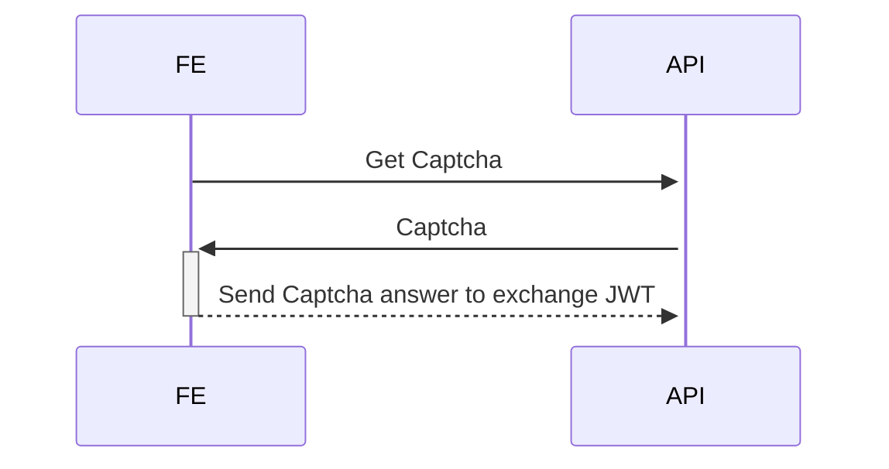

# Sample

https://hub.docker.com/r/genschsa/mysql-employees

# Todos

- security JWT token
- Logging with X-Request-ID

- GET /captchas
- POST /exchange
- GET /todos
- POST /todos
- PUT /todos/:id
- GET /ping

Authen Flow

s := captcha.Gen(1,1,1,1)
pattern: 1/2
leftOperand:
Operator: 1 = +, 2 = -, 3 = *
rightOperand:

1,1,1,1
1 + one
2,1,2,1
one - 1

cc := captcha.New(1,1,1,1)
cc.String()

// http Client

client := &http.Client{
	Transport: &http.Transport{
		MaxIdleConnsPerHost: 100,
		MaxConnsPerHost:     100,
	},
}